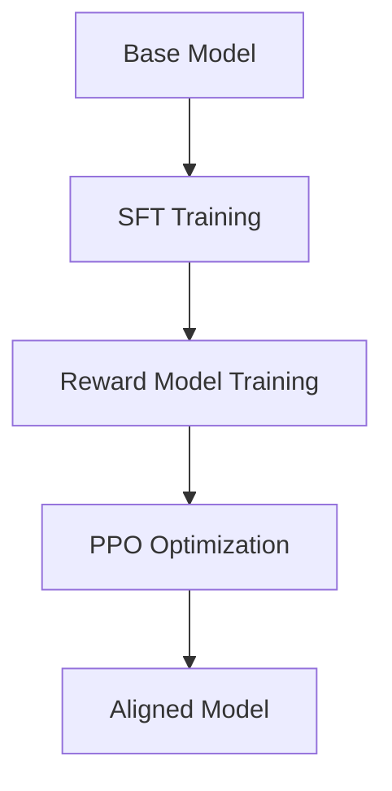

# 🚀 Direct Preference Optimization (DPO) Algorithm Tutorial

<div align="center">


**A Comprehensive Guide to Direct Preference Optimization in MiniMind**

*Building Better Language Models Through Human Preference Learning*

---

**Author:** MiniMind Team  
**Date:** 2025-07-15  
**Version:** 1.0  
**Target Audience:** ML Researchers, AI Engineers, and Students

</div>

## 📋 Table of Contents

- [🚀 Direct Preference Optimization (DPO) Algorithm Tutorial](#-direct-preference-optimization-dpo-algorithm-tutorial)
  - [📋 Table of Contents](#-table-of-contents)
  - [📖 Executive Summary](#-executive-summary)
  - [🎯 Learning Objectives](#-learning-objectives)
  - [🔍 Background Knowledge](#-background-knowledge)
    - [🤖 Reinforcement Learning from Human Feedback (RLHF)](#-reinforcement-learning-from-human-feedback-rlhf)
    - [⚡ Traditional PPO-based Alignment](#-traditional-ppo-based-alignment)
    - [🎯 Reward Model Limitations](#-reward-model-limitations)
    - [💡 DPO's Innovation](#-dpos-innovation)
  - [🧮 DPO Algorithm Deep Dive](#-dpo-algorithm-deep-dive)
    - [📊 Core Mathematical Formulation](#-core-mathematical-formulation)
    - [🔄 Algorithm Overview](#-algorithm-overview)
    - [📈 Loss Function Derivation](#-loss-function-derivation)
    - [🆚 DPO vs Traditional RLHF Comparison](#-dpo-vs-traditional-rlhf-comparison)
  - [💻 Code Analysis: train_dpo.py](#-code-analysis-train_dpopy)
    - [🏗️ File Structure Overview](#️-file-structure-overview)
    - [🔧 Key Functions Analysis](#-key-functions-analysis)
    - [📊 DPODataset Class Deep Dive](#-dpodataset-class-deep-dive)
    - [🔄 Training Loop Implementation](#-training-loop-implementation)
  - [🛠️ Implementation Guide](#️-implementation-guide)
    - [📁 Data Format Requirements](#-data-format-requirements)
    - [⚙️ Configuration and Setup](#️-configuration-and-setup)
    - [🚀 Training Commands](#-training-commands)
    - [📊 Monitoring and Evaluation](#-monitoring-and-evaluation)
  - [🎛️ Advanced Topics](#️-advanced-topics)
    - [🔍 Beta Parameter Tuning](#-beta-parameter-tuning)
    - [🤖 Reference Model Selection](#-reference-model-selection)
    - [📈 Performance Optimization](#-performance-optimization)
  - [❓ Frequently Asked Questions](#-frequently-asked-questions)
  - [📚 Mathematical Appendix](#-mathematical-appendix)
  - [🔗 References and Further Reading](#-references-and-further-reading)

---

## 📖 Executive Summary

Direct Preference Optimization (DPO) represents a significant breakthrough in language model alignment, offering a **simpler, more stable, and computationally efficient** alternative to traditional Reinforcement Learning from Human Feedback (RLHF) methods. Unlike conventional approaches that require explicit reward modeling and complex RL training pipelines, DPO directly optimizes model preferences using simple classification-style losses.

> **Key Innovation**: DPO eliminates the need for reward models and RL training by directly optimizing the policy to prefer chosen responses over rejected ones, making alignment training more accessible and stable.

This tutorial provides a comprehensive analysis of DPO implementation in the MiniMind framework, covering theoretical foundations, practical implementation, and advanced optimization strategies.

---

## 🎯 Learning Objectives

By the end of this tutorial, you will be able to:

- ✅ **Understand** the theoretical foundations of DPO and its advantages over traditional RLHF
- ✅ **Implement** DPO training using the MiniMind framework
- ✅ **Analyze** the core DPO loss function and its mathematical derivation
- ✅ **Configure** optimal hyperparameters for DPO training
- ✅ **Debug** common issues in DPO implementation
- ✅ **Optimize** training performance and model quality

---

## 🔍 Background Knowledge

### 🤖 Reinforcement Learning from Human Feedback (RLHF)

Traditional RLHF involves a complex multi-stage process:

1. **Supervised Fine-tuning (SFT)**: Train the model on demonstration data
2. **Reward Model Training**: Train a separate model to predict human preferences
3. **RL Optimization**: Use PPO to optimize the policy against the reward model



### ⚡ Traditional PPO-based Alignment

**Proximal Policy Optimization (PPO)** has been the standard approach for RLHF:

- **Advantages**: Well-established, theoretically sound
- **Disadvantages**: Complex implementation, unstable training, requires reward model

### 🎯 Reward Model Limitations

**Reward models introduce several challenges:**

| Challenge | Impact | Solution in DPO |
|-----------|--------|----------------|
| **Reward Hacking** | Model exploits reward model weaknesses | Direct preference optimization |
| **Distributional Shift** | Reward model fails on new data | Uses reference model for stability |
| **Training Instability** | PPO training can be unstable | Stable classification loss |
| **Computational Cost** | Requires separate reward model | Single-stage training |

### 💡 DPO's Innovation

DPO revolutionizes alignment by:

- **🎯 Direct Optimization**: No reward model required
- **🔄 Stable Training**: Uses classification loss instead of RL
- **⚡ Efficiency**: Single-stage training process
- **🎨 Simplicity**: Easier to implement and debug

---

## 🧮 DPO Algorithm Deep Dive

### 📊 Core Mathematical Formulation

The DPO algorithm is based on the following key insight: **we can directly optimize the policy to prefer chosen responses over rejected ones** without explicitly modeling rewards.

**Bradley-Terry Model Foundation:**

$$P(y_w \succ y_l | x) = \frac{\exp(r(x, y_w))}{\exp(r(x, y_w)) + \exp(r(x, y_l))}$$

Where:
- $y_w$: Chosen (winning) response
- $y_l$: Rejected (losing) response  
- $x$: Input prompt
- $r(x, y)$: Reward function

**DPO Key Insight:**

Instead of learning $r(x, y)$ explicitly, we can reparameterize it in terms of the policy:

$$r(x, y) = \beta \log \frac{\pi_\theta(y|x)}{\pi_{\text{ref}}(y|x)} + Z(x)$$

Where:
- $\pi_\theta(y|x)$: Current policy
- $\pi_{\text{ref}}(y|x)$: Reference policy
- $\beta$: Temperature parameter
- $Z(x)$: Partition function (cancels out in ratios)

### 🔄 Algorithm Overview

<details>
<summary><strong>📋 Click to expand: DPO Algorithm Steps</strong></summary>

1. **Data Preparation**: Collect preference pairs $(x, y_w, y_l)$
2. **Reference Model**: Initialize reference policy $\pi_{\text{ref}}$
3. **Policy Update**: Optimize current policy $\pi_\theta$ using DPO loss
4. **Iteration**: Repeat until convergence

**Pseudocode:**
```python
for batch in preference_data:
    # Compute log probabilities
    logp_chosen = policy.log_prob(chosen_response)
    logp_rejected = policy.log_prob(rejected_response)
    
    # Compute reference log probabilities
    logp_chosen_ref = ref_policy.log_prob(chosen_response)
    logp_rejected_ref = ref_policy.log_prob(rejected_response)
    
    # Compute DPO loss
    logits = beta * ((logp_chosen - logp_rejected) - 
                     (logp_chosen_ref - logp_rejected_ref))
    loss = -torch.nn.functional.logsigmoid(logits).mean()
    
    # Update policy
    loss.backward()
    optimizer.step()
```
</details>

### 📈 Loss Function Derivation

**Step 1: Bradley-Terry Preference Model**

Starting with the preference probability:

$$P(y_w \succ y_l | x) = \sigma(\beta \log \frac{\pi_\theta(y_w|x)}{\pi_{\text{ref}}(y_w|x)} - \beta \log \frac{\pi_\theta(y_l|x)}{\pi_{\text{ref}}(y_l|x)})$$

**Step 2: DPO Loss Function**

The negative log-likelihood of the preference data:

$$L_{\text{DPO}}(\pi_\theta; \pi_{\text{ref}}) = -\mathbb{E}_{(x,y_w,y_l) \sim D} \left[ \log \sigma \left( \beta \log \frac{\pi_\theta(y_w|x)}{\pi_{\text{ref}}(y_w|x)} - \beta \log \frac{\pi_\theta(y_l|x)}{\pi_{\text{ref}}(y_l|x)} \right) \right]$$

**Step 3: Practical Implementation**

In code, this becomes:

```python
def dpo_loss(ref_probs, probs, mask, beta):
    # Compute average log probabilities
    seq_lengths = mask.sum(dim=1, keepdim=True)
    ref_probs = (ref_probs * mask).sum(dim=1) / seq_lengths.squeeze()
    probs = (probs * mask).sum(dim=1) / seq_lengths.squeeze()
    
    # Split chosen and rejected
    batch_size = ref_probs.shape[0]
    chosen_ref_probs = ref_probs[:batch_size // 2]
    reject_ref_probs = ref_probs[batch_size // 2:]
    chosen_probs = probs[:batch_size // 2]
    reject_probs = probs[batch_size // 2:]
    
    # Compute logits
    pi_logratios = chosen_probs - reject_probs
    ref_logratios = chosen_ref_probs - reject_ref_probs
    logits = pi_logratios - ref_logratios
    
    # DPO loss
    loss = -F.logsigmoid(beta * logits)
    return loss.mean()
```

### 🆚 DPO vs Traditional RLHF Comparison

| Aspect | Traditional RLHF | DPO |
|--------|------------------|-----|
| **🏗️ Architecture** | Base Model → SFT → Reward Model → PPO | Base Model → SFT → DPO |
| **📊 Training Stages** | 3 stages | 2 stages |
| **🧠 Reward Model** | Required | Not required |
| **⚡ Training Stability** | Can be unstable (PPO) | More stable (classification loss) |
| **💰 Computational Cost** | High (multiple models) | Lower (single model) |
| **🔧 Implementation** | Complex | Simpler |
| **🎯 Hyperparameter Tuning** | Many hyperparameters | Fewer hyperparameters |
| **🐛 Debugging** | Difficult | Easier |
| **📈 Performance** | Good | Comparable or better |

---

## 💻 Code Analysis: train_dpo.py

### 🏗️ File Structure Overview

The `train_dpo.py` file implements a complete DPO training pipeline with the following key components:

```python
# Core imports for DPO training
import torch
import torch.nn.functional as F
from torch.utils.data import DataLoader
from model.model_minimind import MiniMindForCausalLM
from dataset.lm_dataset import DPODataset
```

**File Organization:**
- 🔧 **Utility Functions**: Logger, learning rate scheduler
- 📊 **Core Algorithm**: DPO loss computation
- 🚀 **Training Loop**: Main training epoch implementation
- 🤖 **Model Setup**: Model and tokenizer initialization
- 🌐 **Distributed Training**: Multi-GPU support

### 🔧 Key Functions Analysis

#### 1. `logits_to_probs()` Function

```python
def logits_to_probs(logits, labels):
    """
    Convert logits to log probabilities for specific tokens.
    
    Args:
        logits: Model output logits (batch_size, seq_len, vocab_size)
        labels: Target token IDs (batch_size, seq_len)
    
    Returns:
        probs: Log probabilities for target tokens (batch_size, seq_len)
    """
    log_probs = F.log_softmax(logits, dim=2)
    probs = torch.gather(log_probs, dim=2, index=labels.unsqueeze(2)).squeeze(-1)
    return probs
```

**Key Points:**
- ⚡ **Efficient Computation**: Uses `torch.gather` for efficient token probability extraction
- 📊 **Log-Space Operations**: Works in log space for numerical stability
- 🎯 **Token-Level Probs**: Extracts probabilities for specific target tokens

#### 2. `dpo_loss()` Function - The Heart of DPO

<details>
<summary><strong>🔍 Click to expand: Complete DPO Loss Implementation</strong></summary>

```python
def dpo_loss(ref_probs, probs, mask, beta):
    """
    Compute DPO loss for preference optimization.
    
    Args:
        ref_probs: Reference model log probabilities (batch_size, seq_len)
        probs: Current model log probabilities (batch_size, seq_len)
        mask: Attention mask (batch_size, seq_len)
        beta: Temperature parameter for DPO loss
    
    Returns:
        loss: DPO loss value
    """
    # Compute sequence-level average log probabilities
    seq_lengths = mask.sum(dim=1, keepdim=True)  # (batch_size, 1)
    ref_probs = (ref_probs * mask).sum(dim=1) / seq_lengths.squeeze()
    probs = (probs * mask).sum(dim=1) / seq_lengths.squeeze()
    
    # Split chosen and rejected data
    batch_size = ref_probs.shape[0]
    chosen_ref_probs = ref_probs[:batch_size // 2]
    reject_ref_probs = ref_probs[batch_size // 2:]
    chosen_probs = probs[:batch_size // 2]
    reject_probs = probs[batch_size // 2:]
    
    # Compute log ratios
    pi_logratios = chosen_probs - reject_probs
    ref_logratios = chosen_ref_probs - reject_ref_probs
    logits = pi_logratios - ref_logratios
    
    # DPO loss using log-sigmoid
    loss = -F.logsigmoid(beta * logits)
    return loss.mean()
```

**Mathematical Breakdown:**

1. **Sequence-Level Averaging**: 
   ```python
   seq_lengths = mask.sum(dim=1, keepdim=True)
   probs = (probs * mask).sum(dim=1) / seq_lengths.squeeze()
   ```
   - Computes average log probability per sequence
   - Handles variable sequence lengths correctly

2. **Preference Pair Processing**:
   ```python
   chosen_probs = probs[:batch_size // 2]
   reject_probs = probs[batch_size // 2:]
   ```
   - Assumes batch contains paired chosen/rejected responses
   - First half: chosen responses, Second half: rejected responses

3. **DPO Logits Computation**:
   ```python
   pi_logratios = chosen_probs - reject_probs
   ref_logratios = chosen_ref_probs - reject_ref_probs
   logits = pi_logratios - ref_logratios
   ```
   - Implements the core DPO preference modeling
   - Removes reference model bias

4. **Loss Calculation**:
   ```python
   loss = -F.logsigmoid(beta * logits)
   ```
   - Uses log-sigmoid for numerical stability
   - Beta parameter controls optimization strength

</details>

#### 3. `train_epoch()` Function

The main training loop implements the complete DPO training process:

```python
def train_epoch(epoch, wandb):
    """Main training loop for one epoch."""
    start_time = time.time()
    
    for step, batch in enumerate(train_loader):
        # Load batch data
        x_chosen = batch['x_chosen'].to(args.device)
        x_rejected = batch['x_rejected'].to(args.device)
        y_chosen = batch['y_chosen'].to(args.device)
        y_rejected = batch['y_rejected'].to(args.device)
        mask_chosen = batch['mask_chosen'].to(args.device)
        mask_rejected = batch['mask_rejected'].to(args.device)
        
        # Concatenate chosen and rejected for batch processing
        x = torch.cat([x_chosen, x_rejected], dim=0)
        y = torch.cat([y_chosen, y_rejected], dim=0)
        mask = torch.cat([mask_chosen, mask_rejected], dim=0)
        
        # Learning rate scheduling
        lr = get_lr(epoch * iter_per_epoch + step, 
                   args.epochs * iter_per_epoch, 
                   args.learning_rate)
        for param_group in optimizer.param_groups:
            param_group['lr'] = lr
        
        # Forward pass with mixed precision
        with ctx:
            # Reference model inference (no gradients)
            with torch.no_grad():
                ref_outputs = ref_model(x)
                ref_logits = ref_outputs.logits
            ref_probs = logits_to_probs(ref_logits, y)
            ref_probs = ref_probs * mask
            
            # Current model inference
            outputs = model(x)
            logits = outputs.logits
            probs = logits_to_probs(logits, y)
            probs = probs * mask
            
            # Compute DPO loss
            loss = dpo_loss(ref_probs, probs, mask, beta=0.1)
            loss = loss / args.accumulation_steps
        
        # Backward pass with gradient scaling
        scaler.scale(loss).backward()
        
        # Gradient accumulation and optimization
        if (step + 1) % args.accumulation_steps == 0:
            scaler.unscale_(optimizer)
            torch.nn.utils.clip_grad_norm_(model.parameters(), args.grad_clip)
            scaler.step(optimizer)
            scaler.update()
            optimizer.zero_grad(set_to_none=True)
```

**Key Features:**
- 🔥 **Mixed Precision**: Uses automatic mixed precision for efficiency
- 🎯 **Gradient Accumulation**: Supports larger effective batch sizes
- 🔄 **Learning Rate Scheduling**: Cosine annealing schedule
- 🛡️ **Gradient Clipping**: Prevents gradient explosion
- 📊 **Logging**: Comprehensive training metrics

### 📊 DPODataset Class Deep Dive

The `DPODataset` class handles preference pair data processing:

```python
class DPODataset(Dataset):
    """Dataset for Direct Preference Optimization training."""
    
    def __init__(self, file_path, tokenizer, max_length=4096):
        self.tokenizer = tokenizer
        self.max_length = max_length
        self.padding = tokenizer.pad_token_id or 0
        
        # Special tokens for loss masking
        self.bos_id = tokenizer('<|im_start|>assistant', add_special_tokens=False).input_ids
        self.eos_id = tokenizer('<|im_end|>', add_special_tokens=False).input_ids
        
        # Load preference pairs
        with open(file_path, 'r', encoding='utf-8') as f:
            self.data = [json.loads(line) for line in f]
    
    def __getitem__(self, index):
        """Process a single preference pair."""
        sample = self.data[index]
        
        # Process chosen response
        chosen_data = self.process_conversation(sample['chosen'])
        rejected_data = self.process_conversation(sample['rejected'])
        
        return {
            'x_chosen': chosen_data['input_ids'],
            'y_chosen': chosen_data['labels'],
            'mask_chosen': chosen_data['loss_mask'],
            'x_rejected': rejected_data['input_ids'],
            'y_rejected': rejected_data['labels'],
            'mask_rejected': rejected_data['loss_mask']
        }
```

**Data Processing Pipeline:**

1. **Conversation Formatting**: Converts chat format to model input
2. **Tokenization**: Converts text to token IDs
3. **Loss Masking**: Masks user input tokens (only compute loss on assistant responses)
4. **Padding**: Ensures consistent sequence lengths

### 🔄 Training Loop Implementation

**Model Initialization:**
```python
def init_model(lm_config):
    """Initialize model, reference model, and tokenizer."""
    tokenizer = AutoTokenizer.from_pretrained('../model/')
    model = MiniMindForCausalLM(lm_config)
    
    # Load SFT checkpoint
    ckp = f'{args.save_dir}/full_sft_{lm_config.hidden_size}{moe_path}.pth'
    state_dict = torch.load(ckp, map_location=args.device)
    model.load_state_dict(state_dict, strict=False)
    
    # Initialize reference model (frozen)
    ref_model = MiniMindForCausalLM(lm_config)
    ref_model.load_state_dict(state_dict, strict=False)
    ref_model.eval()
    ref_model.requires_grad_(False)
    
    return model, ref_model, tokenizer
```

**Training Setup:**
```python
# Mixed precision training
scaler = torch.cuda.amp.GradScaler(enabled=(args.dtype in ['float16', 'bfloat16']))

# Optimizer setup
optimizer = optim.AdamW(model.parameters(), lr=args.learning_rate)

# Distributed training
if ddp:
    model = DistributedDataParallel(model, device_ids=[ddp_local_rank])
```

---

## 🛠️ Implementation Guide

### 📁 Data Format Requirements

DPO training requires preference pair data in JSONL format. Each line should contain:

```json
{
  "chosen": [
    {"role": "user", "content": "Explain quantum computing"},
    {"role": "assistant", "content": "Quantum computing is a revolutionary computing paradigm that leverages quantum mechanical phenomena..."}
  ],
  "rejected": [
    {"role": "user", "content": "Explain quantum computing"},
    {"role": "assistant", "content": "Quantum computing is just faster regular computing..."}
  ]
}
```

**Data Quality Guidelines:**

| Aspect | Requirement | Example |
|--------|-------------|---------|
| **Prompt Consistency** | Same user prompt for both responses | ✅ Identical user messages |
| **Response Quality** | Clear preference difference | ✅ Helpful vs unhelpful responses |
| **Length Balance** | Avoid extreme length differences | ✅ Similar response lengths |
| **Diversity** | Varied prompts and domains | ✅ Multiple topics covered |

### ⚙️ Configuration and Setup

**Basic Configuration:**
```python
# Model configuration
parser.add_argument('--hidden_size', default=512, type=int)
parser.add_argument('--num_hidden_layers', default=8, type=int)
parser.add_argument('--max_seq_len', default=1024, type=int)

# Training configuration
parser.add_argument("--epochs", type=int, default=2)
parser.add_argument("--batch_size", type=int, default=4)
parser.add_argument("--learning_rate", type=float, default=1e-8)
parser.add_argument("--accumulation_steps", type=int, default=1)
parser.add_argument("--grad_clip", type=float, default=1.0)
```

**Important Notes:**

⚠️ **Learning Rate**: DPO typically uses much lower learning rates than SFT (≤1e-8)
⚠️ **Beta Parameter**: Controls optimization strength (default: 0.1)
⚠️ **Sequence Length**: Longer sequences may require more memory

### 🚀 Training Commands

**Single GPU Training:**
```bash
python trainer/train_dpo.py \
    --data_path /path/to/dpo_data.jsonl \
    --epochs 2 \
    --batch_size 4 \
    --learning_rate 1e-8 \
    --max_seq_len 1024 \
    --hidden_size 512
```

**Multi-GPU Training:**
```bash
torchrun --nproc_per_node=4 trainer/train_dpo.py \
    --ddp \
    --data_path /path/to/dpo_data.jsonl \
    --epochs 2 \
    --batch_size 2 \
    --learning_rate 1e-8 \
    --max_seq_len 1024 \
    --hidden_size 512
```

**With Weights & Biases Logging:**
```bash
python trainer/train_dpo.py \
    --use_wandb \
    --wandb_project "MiniMind-DPO" \
    --data_path /path/to/dpo_data.jsonl \
    --epochs 2 \
    --batch_size 4 \
    --learning_rate 1e-8
```

### 📊 Monitoring and Evaluation

**Training Metrics:**
- 📉 **Loss**: DPO loss should decrease steadily
- 📈 **Learning Rate**: Cosine annealing schedule
- ⏱️ **Training Time**: Monitor training efficiency
- 💾 **Memory Usage**: Track GPU memory consumption

**Evaluation Strategies:**
1. **Automatic Evaluation**: Use reward models or preference classifiers
2. **Human Evaluation**: Manual assessment of response quality
3. **Benchmark Testing**: Standard NLP benchmarks
4. **A/B Testing**: Compare against baseline models

---

## 🎛️ Advanced Topics

### 🔍 Beta Parameter Tuning

The beta parameter in DPO controls the strength of preference optimization:

```python
loss = -F.logsigmoid(beta * logits)
```

**Beta Parameter Effects:**

| Beta Value | Effect | Use Case |
|------------|--------|----------|
| **0.01** | Weak preference signal | Conservative optimization |
| **0.1** | Moderate preference signal | **Recommended default** |
| **0.5** | Strong preference signal | Aggressive optimization |
| **1.0** | Very strong preference signal | Risk of overfitting |

**Tuning Strategy:**
1. **Start Conservative**: Begin with β = 0.1
2. **Monitor Training**: Watch for overfitting signs
3. **Adjust Gradually**: Increase/decrease by factors of 2-3
4. **Evaluate Quality**: Test on held-out data

### 🤖 Reference Model Selection

The reference model $\pi_{\text{ref}}$ is crucial for DPO stability:

**Options:**
- 🎯 **SFT Model**: Use the supervised fine-tuned model
- 🔄 **Previous Checkpoint**: Use earlier DPO checkpoint
- 🎨 **Base Model**: Use the pre-trained base model

**Best Practices:**
```python
# Reference model setup
ref_model = MiniMindForCausalLM(lm_config)
ref_model.load_state_dict(sft_state_dict, strict=False)
ref_model.eval()
ref_model.requires_grad_(False)  # Freeze reference model
```

### 📈 Performance Optimization

**Memory Optimization:**
- 🔧 **Gradient Checkpointing**: Reduce memory usage
- ⚡ **Mixed Precision**: Use FP16/BF16 training
- 📊 **Batch Size Tuning**: Optimize batch size for hardware

**Speed Optimization:**
- 🚀 **Gradient Accumulation**: Increase effective batch size
- 🌐 **Multi-GPU Training**: Distribute across multiple GPUs
- 💾 **DataLoader Optimization**: Optimize data loading

```python
# Memory optimization
torch.cuda.empty_cache()  # Clear GPU cache
model.gradient_checkpointing_enable()  # Enable gradient checkpointing

# Speed optimization
torch.backends.cudnn.benchmark = True  # Optimize cuDNN
torch.set_float32_matmul_precision('medium')  # Optimize matmul
```

---

## ❓ Frequently Asked Questions

<details>
<summary><strong>Q: Why is my DPO loss not decreasing?</strong></summary>

**Possible causes and solutions:**

1. **Learning Rate Too High**
   - **Problem**: Learning rate > 1e-6 may be too aggressive
   - **Solution**: Reduce to 1e-8 or lower

2. **Poor Data Quality**
   - **Problem**: Unclear preference differences
   - **Solution**: Improve data labeling quality

3. **Reference Model Issues**
   - **Problem**: Reference model not loaded correctly
   - **Solution**: Verify reference model initialization

4. **Beta Parameter**
   - **Problem**: Beta too small (< 0.01)
   - **Solution**: Increase beta to 0.1

</details>

<details>
<summary><strong>Q: How much training data do I need for DPO?</strong></summary>

**Data Requirements:**

- **Minimum**: 1,000 preference pairs
- **Recommended**: 10,000+ preference pairs
- **Optimal**: 100,000+ preference pairs

**Quality vs Quantity:**
- High-quality data is more important than quantity
- Focus on clear preference differences
- Ensure diverse prompts and domains

</details>

<details>
<summary><strong>Q: Can I use DPO with different model architectures?</strong></summary>

**Yes!** DPO is architecture-agnostic and works with:

- ✅ **Transformer models** (GPT, BERT, etc.)
- ✅ **Different sizes** (small to large models)
- ✅ **Various frameworks** (PyTorch, TensorFlow)

**Key requirements:**
- Model must output logits
- Support for autoregressive generation
- Ability to compute log probabilities

</details>

<details>
<summary><strong>Q: How do I handle out-of-memory errors?</strong></summary>

**Memory optimization strategies:**

1. **Reduce Batch Size**
   ```python
   --batch_size 1 --accumulation_steps 8
   ```

2. **Shorter Sequences**
   ```python
   --max_seq_len 512
   ```

3. **Enable Gradient Checkpointing**
   ```python
   model.gradient_checkpointing_enable()
   ```

4. **Use Mixed Precision**
   ```python
   --dtype bfloat16
   ```

</details>

<details>
<summary><strong>Q: What's the difference between DPO and RLHF?</strong></summary>

**Key Differences:**

| Aspect | RLHF | DPO |
|--------|------|-----|
| **Complexity** | High (3 stages) | Low (2 stages) |
| **Stability** | Can be unstable | More stable |
| **Reward Model** | Required | Not required |
| **Training** | PPO (complex) | Classification (simple) |
| **Performance** | Good | Comparable |

**When to use DPO:**
- ✅ Simpler implementation needed
- ✅ Limited computational resources
- ✅ Want stable training
- ✅ No reward model available

</details>

---

## 📚 Mathematical Appendix

### Complete DPO Loss Derivation

**Starting Point: Reward Model Parameterization**

Given a reward model $r(x, y)$, we can express it as:

$$r(x, y) = \beta \log \frac{\pi_\theta(y|x)}{\pi_{\text{ref}}(y|x)} + Z(x)$$

**Step 1: Bradley-Terry Preference Model**

The probability of preferring response $y_w$ over $y_l$:

$$P(y_w \succ y_l | x) = \frac{\exp(r(x, y_w))}{\exp(r(x, y_w)) + \exp(r(x, y_l))}$$

**Step 2: Substitute Reward Parameterization**

$$P(y_w \succ y_l | x) = \frac{\exp(\beta \log \frac{\pi_\theta(y_w|x)}{\pi_{\text{ref}}(y_w|x)} + Z(x))}{\exp(\beta \log \frac{\pi_\theta(y_w|x)}{\pi_{\text{ref}}(y_w|x)} + Z(x)) + \exp(\beta \log \frac{\pi_\theta(y_l|x)}{\pi_{\text{ref}}(y_l|x)} + Z(x))}$$

**Step 3: Simplify Using Sigmoid**

The $Z(x)$ terms cancel out:

$$P(y_w \succ y_l | x) = \sigma\left(\beta \log \frac{\pi_\theta(y_w|x)}{\pi_{\text{ref}}(y_w|x)} - \beta \log \frac{\pi_\theta(y_l|x)}{\pi_{\text{ref}}(y_l|x)}\right)$$

**Step 4: Final DPO Loss**

The negative log-likelihood:

$$\mathcal{L}_{\text{DPO}} = -\mathbb{E}_{(x,y_w,y_l) \sim \mathcal{D}} \left[ \log \sigma \left( \beta \log \frac{\pi_\theta(y_w|x)}{\pi_{\text{ref}}(y_w|x)} - \beta \log \frac{\pi_\theta(y_l|x)}{\pi_{\text{ref}}(y_l|x)} \right) \right]$$

**Gradient Analysis**

The gradient of the DPO loss with respect to model parameters:

$$\nabla_\theta \mathcal{L}_{\text{DPO}} = -\beta \mathbb{E}_{(x,y_w,y_l)} \left[ \sigma(\hat{r}_\theta(x, y_l) - \hat{r}_\theta(x, y_w)) \left[ \nabla_\theta \log \pi_\theta(y_w|x) - \nabla_\theta \log \pi_\theta(y_l|x) \right] \right]$$

Where $\hat{r}_\theta(x, y) = \beta \log \frac{\pi_\theta(y|x)}{\pi_{\text{ref}}(y|x)}$.

**Key Insights:**

1. **Implicit Reward**: DPO implicitly defines a reward function
2. **Preference Optimization**: Directly optimizes preferences without explicit rewards
3. **Stability**: More stable than RL-based approaches
4. **Efficiency**: Single-stage training process

---

## 🔗 References and Further Reading

### 📖 Core Papers

1. **DPO Original Paper**
   - [Direct Preference Optimization: Your Language Model is Secretly a Reward Model](https://arxiv.org/abs/2305.18290)
   - Rafailov et al., 2023

2. **RLHF Foundation**
   - [Training language models to follow instructions with human feedback](https://arxiv.org/abs/2203.02155)
   - Ouyang et al., 2022

3. **PPO Algorithm**
   - [Proximal Policy Optimization Algorithms](https://arxiv.org/abs/1707.06347)
   - Schulman et al., 2017

### 🛠️ Implementation Resources

- **HuggingFace DPO**: [TRL Library](https://github.com/huggingface/trl)
- **OpenAI Alignment**: [Alignment Research](https://openai.com/research/alignment)
- **Anthropic Constitutional AI**: [Constitutional AI](https://www.anthropic.com/index/constitutional-ai-harmlessness-from-ai-feedback)

### 📊 Datasets

- **Anthropic HH-RLHF**: Human preference data
- **OpenAI WebGPT**: Web-based QA preferences
- **Stanford SHP**: Social media preferences

### 🔧 Tools and Frameworks

- **MiniMind**: This implementation
- **TRL (Transformers Reinforcement Learning)**: HuggingFace library
- **DeepSpeed**: Microsoft's training optimization
- **Weights & Biases**: Experiment tracking

---

<div align="center">

**🎉 Congratulations!** You've completed the comprehensive DPO tutorial.

Start building better aligned language models today! 🚀

---

*This tutorial is part of the MiniMind project - making AI accessible to everyone.*

[](https://github.com/jingyaogong/minimind)
[](https://github.com/jingyaogong/minimind)

</div>